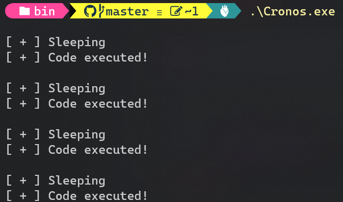

# Cronos

  

## This project was co-authored by

[](https://github.com/idov31) [](https://github.com/janoglezcampos)

## Description

PoC for a new sleep obfuscation technique (based on [Ekko](https://github.com/Cracked5pider/Ekko)) leveraging waitable timers to RC4 encrypt the current process and change the permissions from RW to RX to evade memory scanners.

A more detailed explanation will be available in the [blog post](https://idov31.github.io/2022/11/06/cronos-sleep-obfuscation.html).



## Usage

To use it, all you have to do is to include Cronos in your project and use it like so:

```c
#include "Cronos.h"

int main() {
    int timesToExecute = 1337;
    int seconds = 10;

    for (int i = 0; i < timesToExecute; i++) {
        CronosSleep(seconds);

        // YOUR CODE HERE!
    }
}
```

## Setup

To compile it you will need:

- [NASM](https://www.nasm.us/)
- [make](https://stackoverflow.com/questions/32127524/how-to-install-and-use-make-in-windows)
- [VisualStudio Compiler](https://developer.microsoft.com/en-US/windows/downloads/windows-sdk/)

After you have all of the above, navigate to the project's directory and build it with the makefile, the EXE will be in the bin directory.

## Visual Studio Setup

- [VSNASM](https://github.com/ShiftMediaProject/VSNASM)
  - Run install_script.bat

- Add NASMPATH environment variable
  - NASMPATH=C:\Users\<user>\AppData\Local\bin\NASM\

- Open Visual Studio & Configure Settings
  - Tools > Options > Projects and Solutions > VC++ Project Settings > Build Customization Search Path
  - Set to %NASMPATH%;0

- You can also install the [AsmDude](https://marketplace.visualstudio.com/items?itemName=Henk-JanLebbink.AsmDude) extension for syntax highlighting into .ASM files.

## Contributors

Thanks a lot to those people that contributed to this project:

- [Orca](https://github.com/ORCx41)

- [Xenov-X](https://github.com/Xenov-X)

## Resources

- [Ekko](https://github.com/Cracked5pider/Ekko)
- [DeathSleep](https://github.com/janoglezcampos/DeathSleep)
- [Waitable Timers](https://learn.microsoft.com/en-us/windows/win32/sync/using-a-waitable-timer-with-an-asynchronous-procedure-call)
